```{r Module01-1, eval = FALSE, echo = FALSE}
# layout: true
  
# <div class="my-header"></div>
# <div class="my-footer"><span>xaringan power    
# &emsp;&emsp;&emsp;&emsp;&emsp;&emsp;&emsp;&emsp;&emsp;&emsp;&emsp;&emsp;&emsp;
# &emsp;&emsp;&emsp;&emsp;&emsp;&emsp;&emsp;&emsp;&emsp;&emsp;&emsp;&emsp;&emsp;
# yolo</span></div> 
# 
# xaringan::inf_mr('/Users/ruhil/Documents/Teaching/Data Analytics/presentations/Module01.Rmd') 
# xaringan::inf_mr('./presentations/Module01.Rmd') 
```

```{r jquery, echo=FALSE}
htmltools::tagList(rmarkdown::html_dependency_jquery())
```

```{r setup, include=FALSE}
options(htmltools.dir.version = FALSE)

knitr::opts_chunk$set(
  fig.align = 'center', echo = FALSE, warning = FALSE, message = FALSE, 
  dpi = 300, cache = TRUE, fig.align = "center", fig.width = 8, 
  fig.height = 6, out.width = "60%", fig.retina = 3
  )

xaringanExtra::use_panelset()
```

#### .heat[ Agenda ]

.large[

- Different State data resources  

- Comparing like districts  

- School District Data from the Census Bureau

- The Opportunity Index 

]


---

class: inverse, middle, center

# .fancy[.heat[Different State Data]]

---

#### .heat[State Departments of Education Data]

.panelset[

.panel[
.panel-name[DC]

```{r, out.width = "35%"}
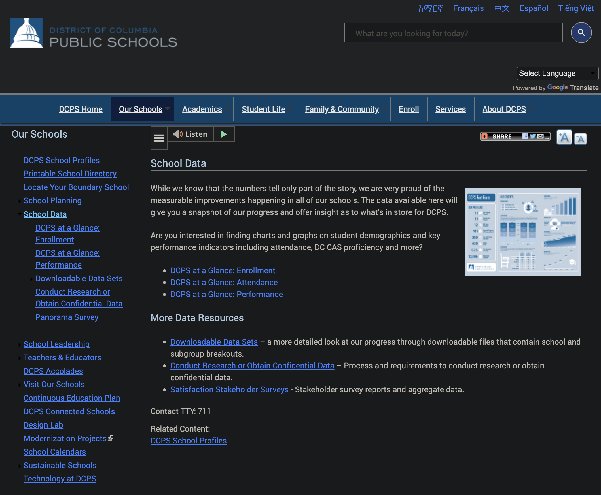
```

[Source: DCPS](https://dcps.dc.gov/service/school-data)
]

.panel[
.panel-name[California (1)]

```{r, out.width = "40%"}
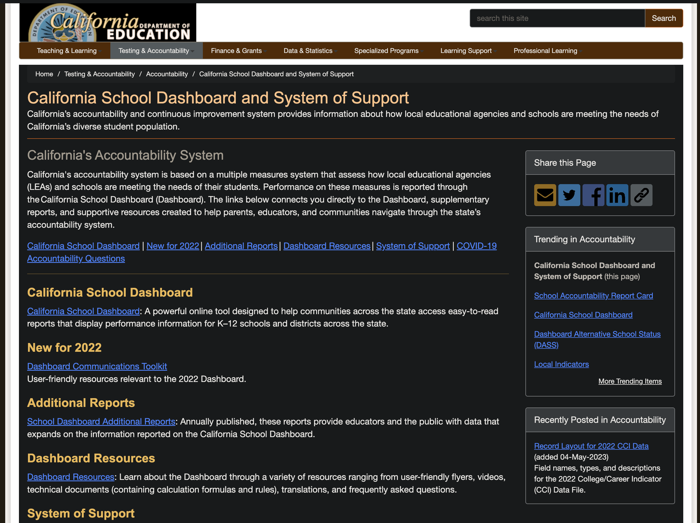
```

[Source: California Department of Education](https://www.cde.ca.gov/ds/)
]

.panel[
.panel-name[California (2)]

```{r, out.width = "45%"}

```

[Source: California School Dashboard](https://www.caschooldashboard.org/)

]

.panel[
.panel-name[Georgia]

```{r, out.width = "30%"}
 

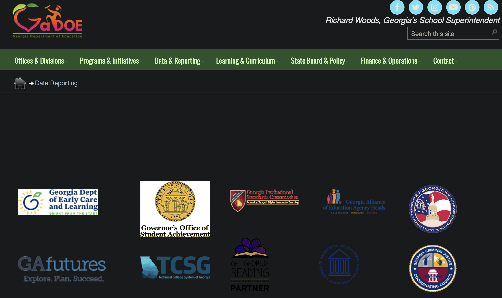

```

[Source: Governor's office of Student Achievement](https://schoolslikemine.gosa.ga.gov/) | [Source: Georgia DOE](https://www.gadoe.org/data-reporting/Pages/default.aspx)
]

.panel[
.panel-name[Kentucky]

```{r, out.width = "45%"}
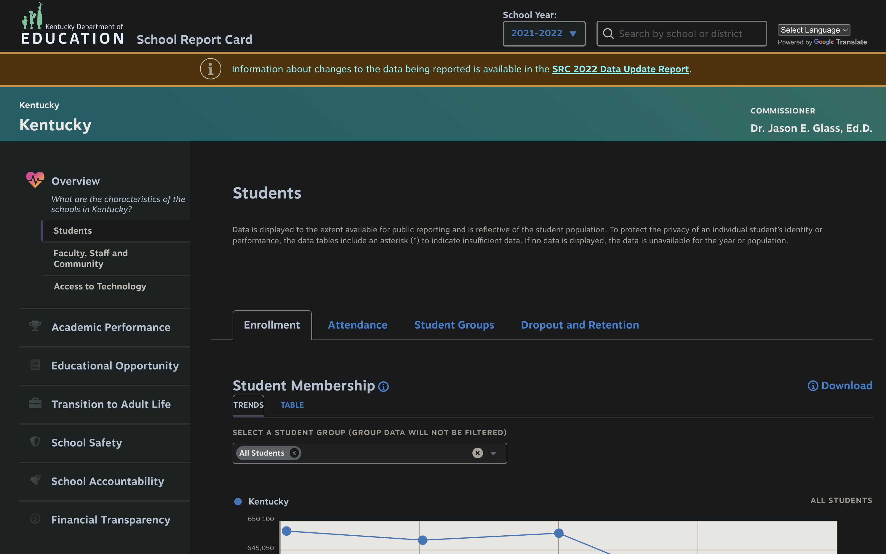
```

[Source: Kentucky Department of Education](https://www.kyschoolreportcard.com/organization/20/school_overview/students/enrollment?year=2022)
]

.panel[
.panel-name[New Jersey]

```{r, out.width = "45%"}
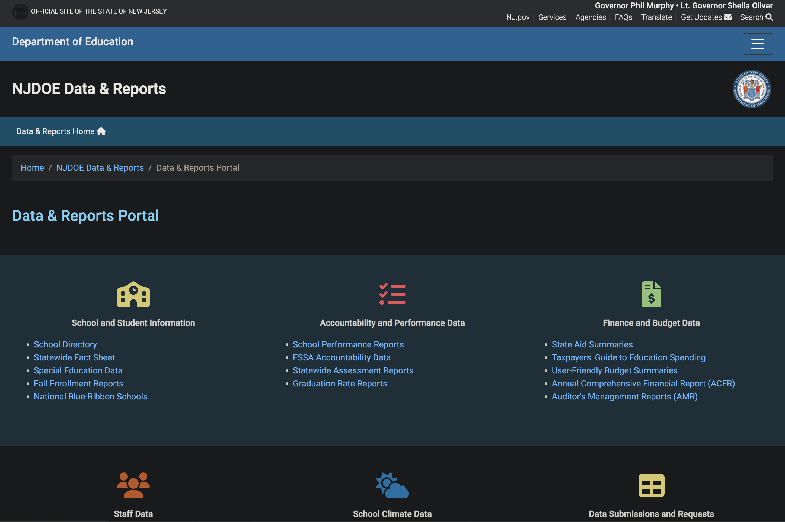
```

[Source: New Jersey Department of Education](https://www.nj.gov/education/doedata/)

]

.panel[
.panel-name[Pennsylvania]

```{r, out.width = "35%"}
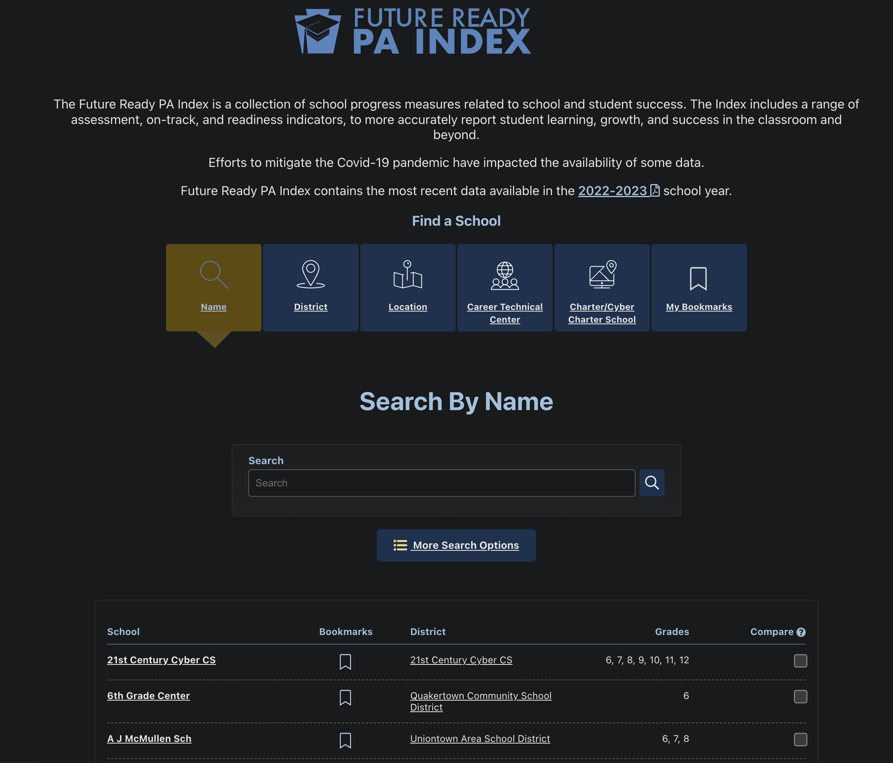
```

[Source: Penssylvania Department of Education](https://futurereadypa.org/)

]

.panel[
.panel-name[Texas]

```{r, out.width = "40%"}
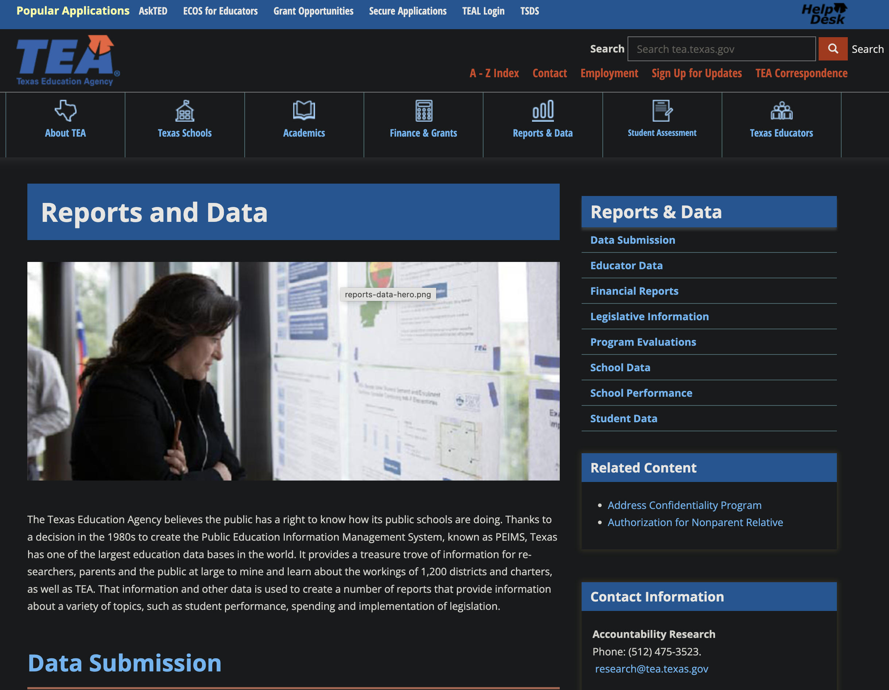
```

[Source: Texas Department of Education](https://tea.texas.gov/reports-and-data)
]


.panel[
.panel-name[Virginia]

```{r, out.width = "40%"}
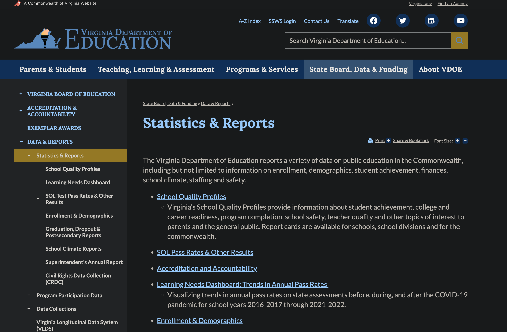
```

[Source: Virginia Department of Education](https://www.doe.virginia.gov/data-policy-funding/data-reports/statistics-reports)
]

]

---

class: inverse, middle, center

# .fancy[.heat[Apples to Apples: Similar Districts]]

---

#### .heat[The Utility of Similar (aka "Peer") Districts]

.panelset[

.panel[.panel-name[Ohio]

```{r, out.width = "40%"}
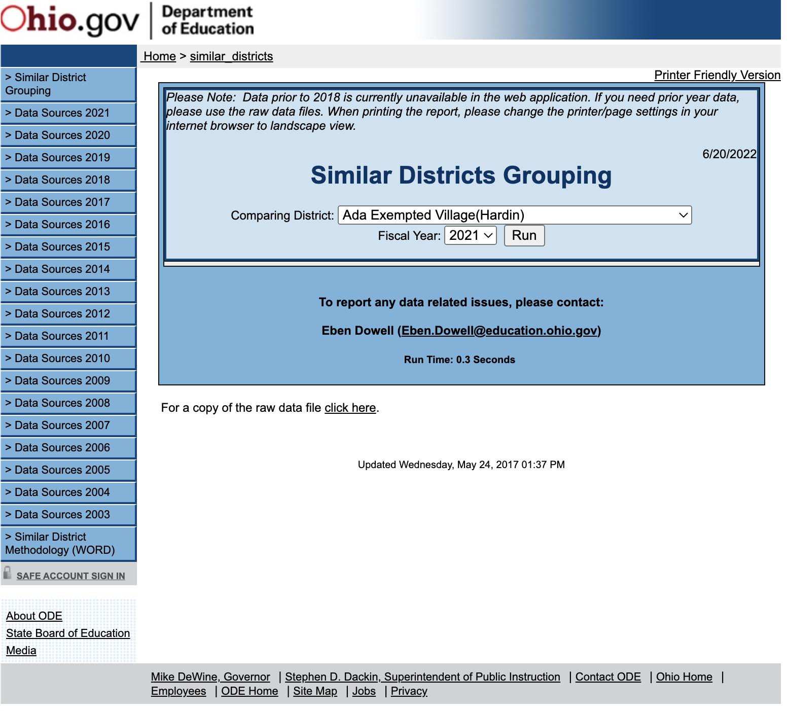
```

[Ohio's Approach](https://webapp2.ode.state.oh.us/similar_districts/Similar_Districts.asp)

]

.panel[.panel-name[Michigan]

```{r, eval = TRUE}
library(tidyverse)

readxl::read_excel(
  here::here(
    "data",
    "2020-21_School_Grades_Results.xlsx"
    )
  ) %>%
  slice_head(n = 2) -> midf

DT::datatable(midf, options = list(
      scroller = TRUE,
      deferRender = TRUE,
      scrollY = 400
      )
      )

```

**Source:** 2020-21_School_Grades_Results.xlsx
]

]

---

# [School District Data from the Census Bureau](https://data.census.gov/)

```{r, out.width="70%"}
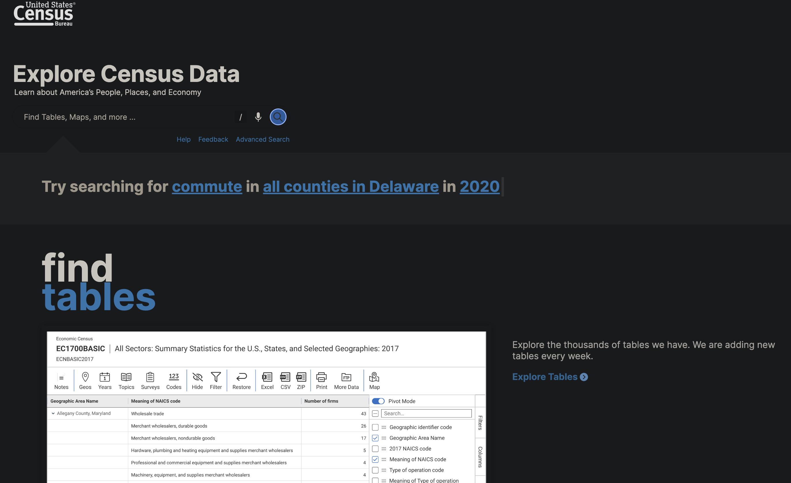
```


---

class: inverse, middle, center

# .fancy[.heat[Equitable Opportunity?]]

---

# [The Opportunity Index](https://opportunityindex.org/)


```{r, out.width="70%"}
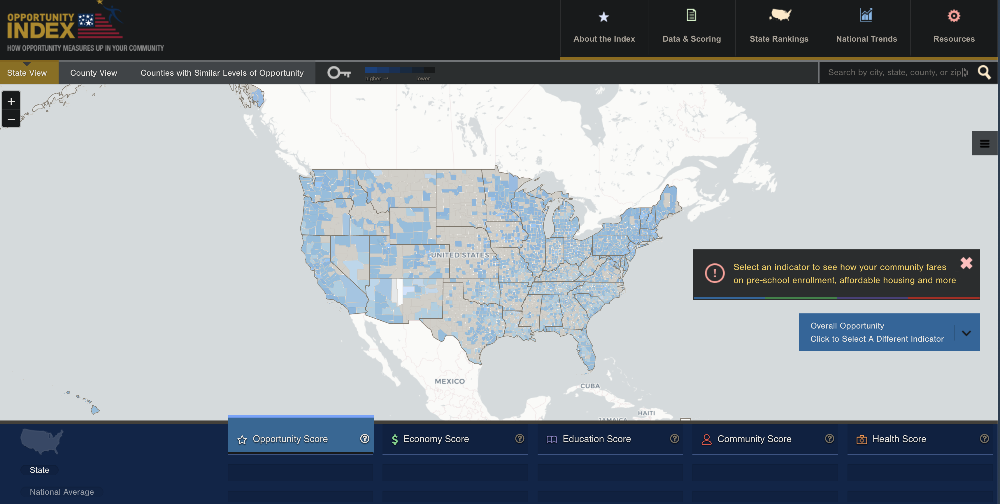
```

---

class: inverse, middle, center

# .fancy[.salt[Questions??]]


